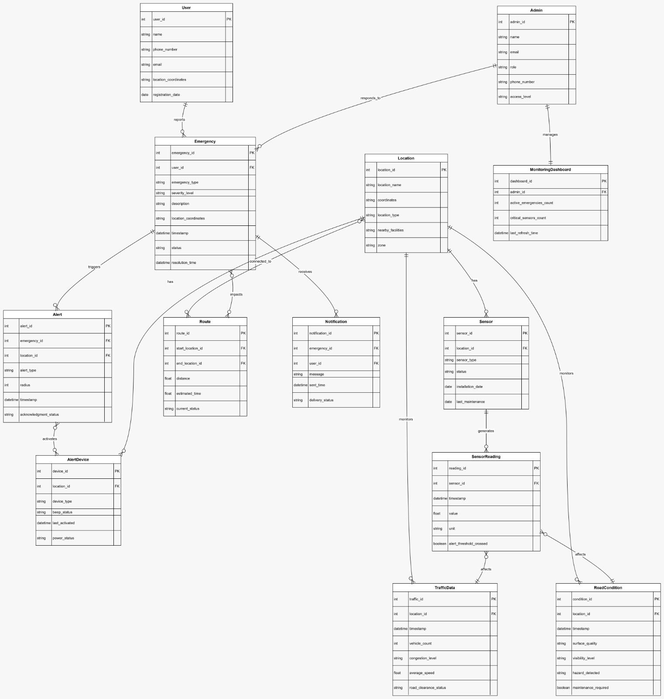

# Smart Emergency Response Monitoring System

This system is a project to manage emergencies. It helps report emergencies, track sensors and traffic, send alerts, and show dashboards to administrators.

## Overview

Users can report emergencies. Alerts are sent automatically. Sensors check the surroundings. Administrators can manage and respond to emergencies. Location, traffic, and road information help respond faster and safer.

## Core Entities

### User
A registered user who can report emergencies.  
Stores contact and location information.  
One user can report many emergencies.

## Flowchart

### Emergency
The main entity.  
Created when a user reports an incident.  
Contains type, severity, description, status, and time.  
Connected to alerts, routes, notifications, and locations.  
Handled by administrators.

### Admin
Manages emergencies.  
Uses dashboards to track system activity.  
Responds according to role and access level.

### MonitoringDashboard
Shows live status for admins.  
Displays active emergencies and important sensors.  
Linked to one admin.  
Updates regularly.

## Location and Environment

### Location
Represents an area or zone.  
Used by emergencies, sensors, traffic, and roads.  
Stores coordinates, type, nearby facilities, and zone info.

### Sensor
Installed at a location.  
Checks environment or infrastructure.  
Has status, type, installation, and maintenance info.

### SensorReading
Data from sensors.  
Stores value, unit, and time.  
Flags readings over alert limits.  
Can affect traffic and road info.

### TrafficData
Tracks traffic at locations.  
Includes vehicle count, congestion, and speed.  
Helps decide road clearance and routes.

### RoadCondition
Shows road safety and usability.  
Includes surface, visibility, and hazards.  
Shows if maintenance is needed.

## Alerts, Routing, and Communication

### Alert
Generated during an emergency.  
Linked to an emergency and a location.  
Stores type, radius, time, and acknowledgment.

### AlertDevice
Devices triggered by alerts.  
Includes sirens and beacons.  
Tracks type, power, and activation time.

### Route
Paths for emergency response.  
Connects start and end points.  
Stores distance, time, and status.  
Affected by traffic and emergencies.

### Notification
Messages sent to users.  
Linked to emergencies.  
Tracks content, time sent, and delivery.

## Relationships

Users report emergencies.  
Emergencies trigger alerts, notifications, and routes.  
Alerts trigger devices.  
Sensors collect traffic and road data.  
Sensor readings affect traffic and roads.  
Admins respond and manage dashboards.

## Purpose

Supports faster emergency response.  
Monitors situations in real time.  
Helps decisions using traffic and sensor info.  
Centralized control through dashboards.

## Notes

Can scale to many locations.  
Works with IoT and real-time data.  
Useful for smart cities and emergency management.

## Future Enhancements

- Live tracking of emergencies  
  Monitor emergency status and response in real time.

- Role-based admin controls  
  Different admin roles with access control and logs.

- Incident analytics and reporting  
  Reports on emergency count, response time, and system performance.

- Mobile application integration  
  Apps for users and admins to report, receive alerts, and respond remotely. 
